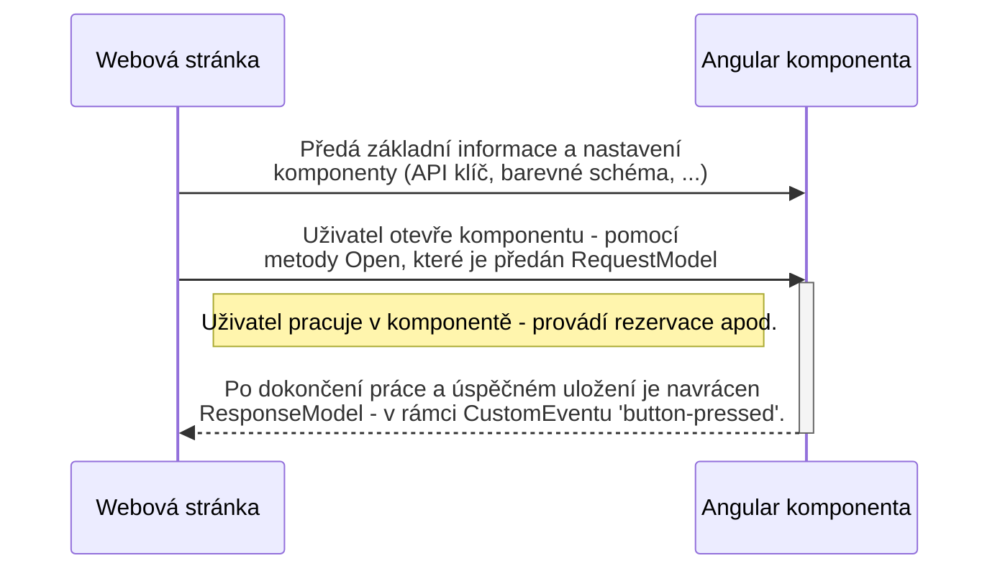

```mermaid
sequenceDiagram
    participant w as Webová stránka
    participant c as Angular komponenta

    
    w->>c: Předá základní informace a nastavení<br/> komponenty (API klíč, barevné schéma, ...)

    w->>c: Uživatel otevře komponentu - pomocí <br/> metody Open, které je předán RequestModel
    activate c

    Note right of w: Uživatel pracuje v komponentě - provádí rezervace apod.

    c-->>w: Po dokončení práce a úspěčném uložení je navrácen <br/> ResponseModel - v rámci CustomEventu 'button-pressed'.
    deactivate c
```